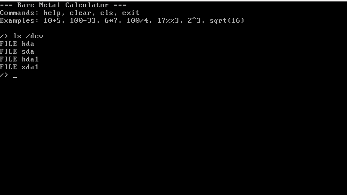
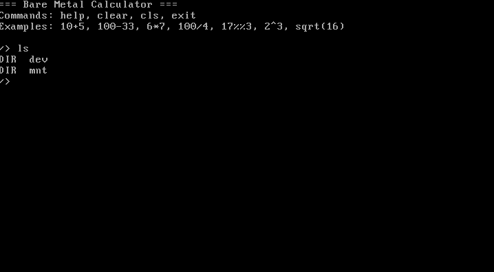
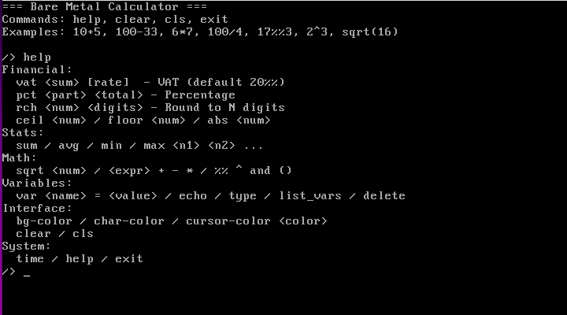

# CalculatorOS

## 📸 Скриншоты





**Bare Metal Calculator** — операционная система-калькулятор, работающая напрямую на железе (без Linux/Windows).  
Поддерживает BIOS и UEFI (через CSM).

## ✨ Возможности

### ➗ Арифметика

- Сложение (`+`), вычитание (`-`), умножение (`*`), деление (`/`), остаток (`%`)
- Степень (`^`), квадратный корень (`sqrt`)
- Скобки и унарный минус

### 📊 Функции

| Команда | Описание | Пример |
|---------|----------|--------|
| `rch x n` | Округление до n знаков | `rch 3.14159 2` → `3.14` |
| `ceil x` / `floor x` | Округление вверх/вниз | `ceil 3.14` → `4.00` |
| `abs x` | Абсолютное значение | `abs -5` → `5.00` |
| `pct x total` | Процент от числа | `pct 20 200` → `10.00%` |
| `vat x [rate]` | НДС (по умолч. 20%) | `vat 100` → `20.00` |
| `sum / avg / min / max` | Множественные аргументы | `sum 10 20 30` → `60.00` |

### 🔧 Переменные

- `var name = value` – создать переменную (int/double/string)
- `echo name` – вывести значение
- `type name` – показать тип
- `list_vars` – список всех переменных
- `delete name` – удалить переменную

### 🎨 Интерфейс

| Команда | Описание |
|---------|----------|
| `bg-color <color>` | Установить цвет фона |
| `char-color <color>` | Установить цвет текста |
| `cursor-color <color>` | Установить цвет курсора |
| `clear` / `cls` | Очистить экран |

**Доступные цвета:** black, blue, green, cyan, red, magenta, brown, lightgray, darkgray, lightblue, lightgreen, lightcyan, lightred, lightmagenta, yellow, white

### 💾 Дисковая подсистема

#### ATA (PIO)

Поддержка классических IDE дисков:
- `/dev/hda`, `/dev/hdb`, `/dev/hdc`, `/dev/hdd` – целые диски
- `/dev/hda1`, `/dev/hda2`, `/dev/hda3`, `/dev/hda4` – разделы MBR
- Чтение и запись через PIO (Programmed I/O)

#### AHCI (DMA) – SATA

Полноценная поддержка SATA через AHCI (Advanced Host Controller Interface):
- `/dev/sda`, `/dev/sdb`, `/dev/sdc`, `/dev/sdd` – SATA диски (до 4 устройств)
- `/dev/sda1`, `/dev/sda2`, `/dev/sda3`, `/dev/sda4` – разделы MBR на SATA
- **DMA (Direct Memory Access)** – данные передаются без участия процессора
- **PRDT (Physical Region Descriptor Table)** – поддержка scatter/gather
- **32 командных слота** – очередь команд
- **Высокая скорость** – до 300 МБ/с (SATA2)
- Реализован строго по спецификации AHCI 1.3.1

### 🔌 USB (EHCI) – Mass Storage

Полноценная поддержка USB 2.0 флешек через EHCI:

- `/dev/usba`, `/dev/usbb`, `/dev/usbc`, `/dev/usbd` – USB флешки (до 4 устройств)
- `/dev/usba1`–`/dev/usbd4` – разделы MBR на USB
- **Async Schedule** – QH (Queue Head) и qTD для Bulk-транзакций
- **Periodic Schedule** – для Interrupt (корневой хаб)
- **USB Mass Storage Class (BOT)** – CBW (31 байт), CSW (13 байт)
- **SCSI:** `READ_CAPACITY`, `READ_10`, `WRITE_10`
- **Hot plug** – обнаружение через polling
- Реализован по спецификации **EHCI 1.0** (Intel, 2002) и **USB Mass Storage Class BOT 1.0**

### 🐚 Файловая система – **MFS**

Дисковая файловая система с поддержкой папок, файлов, разделов MBR и VFS.

#### Работа с файлами и папками

| Команда | Описание | Пример |
|---------|----------|--------|
| `new <file>` | Создать пустой файл | `new test.txt` |
| `newdir <dir>` | Создать папку | `newdir myfolder` |
| `write <file> <text>` | Записать текст в файл | `write test.txt Hello` |
| `cat <file>` | Прочитать файл | `cat test.txt` |
| `rm <file>` | Удалить файл | `rm test.txt` |
| `rmdir <dir>` | Удалить пустую папку | `rmdir myfolder` |
| `cp <src> <dst>` | Копировать файл | `cp test.txt copy.txt` |
| `mv <src> <dst>` | Переместить файл | `mv test.txt moved.txt` |
| `ls [path]` | Список файлов/папок | `ls /myfolder` |
| `cd <path>` | Сменить текущую папку | `cd myfolder` |
| `pwd` | Показать текущий путь | `pwd` |

#### Управление разделами MBR

| Команда | Описание | Пример |
|---------|----------|--------|
| `showpart` | Показать таблицу разделов | `showpart` |
| `mkpart /dev/hda <num> <size>` | Создать раздел (размер в MB) | `mkpart /dev/hda 2 100` |
| `delpart /dev/hda<num>` | Удалить раздел | `delpart /dev/hda2` |
| `format <device>` | Отформатировать раздел в MFS | `format /dev/sda1` |

#### Монтирование и блочные устройства

| Команда | Описание | Пример |
|---------|----------|--------|
| `mount <device> <path>` | Смонтировать раздел в папку | `mount /dev/sda1 /mnt` |
| `umount <path>` | Отмонтировать раздел | `umount /mnt` |
| `ls /dev` | Список устройств | `ls /dev` |

**Блочные устройства:**
- ATA: `/dev/hda`, `/dev/hdb`, `/dev/hdc`, `/dev/hdd`
- ATA разделы: `/dev/hda1`–`/dev/hda4`
- AHCI: `/dev/sda`, `/dev/sdb`, `/dev/sdc`, `/dev/sdd`
- AHCI разделы: `/dev/sda1`–`/dev/sda4`

#### Символические ссылки

| Команда | Описание | Пример |
|---------|----------|--------|
| `symlink <target> <link>` | Создать символическую ссылку | `symlink /home/docs /docs` |
| `readlink <link>` | Показать цель ссылки | `readlink /docs` |

### ⚙️ JIT – ассемблер на лету

Прямое выполнение x86 инструкций (исключения обрабатываются штатно).

```asm
asm mov eax, 42
asm mov ebx, 0
asm div ebx            ; → Divide Error (#DE)
asm int 3              ; → Breakpoint (#BP)
asm ud2                ; → Invalid Opcode (#UD)
asm xor ax, ax
asm mov ds, ax         ; → General Protection Fault (#GP)
asm mov cr0, eax       ; → меняет режим процессора
asm lidt [0]           ; → убивает IDT
```

## ⌨️ Все команды

`vat`, `pct`, `rch`, `ceil`, `floor`, `abs`, `sum`, `avg`, `min`, `max`, `sqrt`
`var`, `echo`, `type`, `list_vars`, `delete`
`new`, `write`, `cat`, `rm`, `newdir`, `rmdir`, `ls`, `cd`, `pwd`, `cp`, `mv`
`mount`, `umount`, `mkpart`, `delpart`, `format`, `showpart`
`symlink`, `readlink`
`bg-color`, `char-color`, `cursor-color`, `clear`, `cls`
`asm`, `time`, `help`, `exit`

## 🛠️ Сборка и запуск

```bash
git clone https://github.com/madmenmadmen/calculatoros.git
cd calculatoros
make
make setup-disk
make setup-disk-sata
make setup-disk-usb
make run
```


-blue)

[](https://www.python.org/)
[]()
